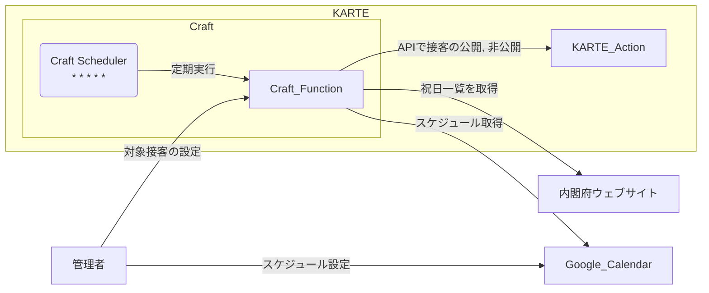

# Summary

## title

KARTE Craft と Google Calendar を使って KARTE の接客配信スケジュールを拡張する

## blogUrl
https://solution.karte.io/blog/2023/06/campaign-scheduler-with-googlecal

## description

KARTE の接客サービスを Google Calendar に登録された予定に応じて公開・停止するためのサンプルコードです。接客サービスの通常の配信設定機能で実現できない配信スケジュールを実現することができます。

## category

機能拡張,CRAFT_SCHEDULER

# 詳細説明

## 構成

構成は以下の通りです。



## 設定手順

設定手順は次の通りです。

### 準備

- Google Cloud のプロジェクトを準備します。
  - プロジェクトの Google Calendar API を有効化しておきます
- KARTE の API v2 が利用できる状態にしておきます

### Google Cloud のサービスアカウントを作成する

- Google Cloud のサービスアカウントを作成します
- サービスアカウントの鍵を JSON 形式で取得します

### Google Calendar にサービスアカウントを追加する

- Google Calendar で接客スケジューラー用のカレンダーを作成します
- カレンダーのメンバーにサービスアカウントのメールアドレスを追加します。閲覧権限を付与します。

### KARTE の API v2 のアプリを作成する

- KARTE の API v2 のアプリを作成します。
  - アプリの種類は `token` です
  - App の Scope には `beta.action.campaign.toggleEnabled` を指定します。
- アプリ作成時に表示されるアクセストークンを控えておきます。

### Craft Secret Manager にシークレットを登録する

- サービスアカウントの鍵データを（JSON 形式のテキスト）をシークレットに登録します。
  - シークレット名は `GOOGLE_CLOUD_SA_KEY` ですが、任意の名前を設定しても構いません。 `GOOGLE_CLOUD_SA_KEY` 以外を設定した場合はコード内のシークレット名を指定している箇所を、自分で設定したシークレット名に置き換えてください。
- API v2 アプリのアクセストークンをシークレットに追加します。
  - シークレット名は `KARTE_API_TOKEN` ですが、任意の名前を設定しても構いません。 `KARTE_API_TOKEN` 以外を設定した場合はコード内のシークレット名を指定している箇所を、自分で設定したシークレット名に置き換えてください。

### Craft Functions を作成する

- campaign-scheduler.js と modules.json の内容をそれぞれ `code` と `modules` に貼り付けます。
  - 先述のシークレット名を任意の名前に変更した場合はコード内の該当箇所を置き換えます。
  - `CALENDAR_ID` に Google Calendar のカレンダー ID を指定します。
- 保存します。

### Craft Functions の起動スケジュールを設定する

- ファンクションの起動スケジュールを設定します。この起動間隔によって接客スケジュールの細かさが決まります。以下は設定例です。
  - `* * * * *` とした場合は毎分起動します。
  - `0/5 * * * *` とした場合は毎時 0 分から 5 分毎に起動します。
  - `0 * * * *` とした場合は 1 時間毎に起動します。（この場合、カレンダーの分単位の設定は無視されます）
  - `15 3 * * *` とした場合は毎日 3:15 に起動します。

## 使い方

使い方は簡単で、コードに対象の接客 ID を指定して、Google Calendar に予定を作成するだけです。

- Craft Functions のコードにカレンダー管理する接客の ID を指定します。
  - `TARGET_CAMPAIGNS` に JavaScript の配列形式で接客 ID を指定します。
- Google Calender に予定を作成します
  - メモ欄に JSON 形式で以下のプロパティを設定します。
    - `campaign_id` 接客の識別子です。管理画面の接客管理画面の URL に含まれる `https://admin.karte.io/p/xxxxxxxxxxxxxxxxxxxxxxxx/service/zzzzzzzzzzzzzzzzzzzzzzzz` の `/service/` 以降の 24 桁の文字列です。
    - `on_holiday` 祝日に接客を公開するかどうか。`enable` もしくは `disable` を指定します。 `enable` の場合は祝日の場合に公開します。 `disable` の場合は祝日の場合に非公開にします。このプロパティは省略可能で、省略時は `enable` と解釈されます。
  ```
  { "campaign_id": "zzzzzzzzzzzzzzzzzzzzzzzz", "on_holiday": "(enable|disable)" }
  ```
  - メモ欄には上記の JSON 以外は入力しないでください。
  - タイトルに接客のわかりやすい名前を記入します。

## 終了方法

スケジューラーを終了する場合は、以下の手順で作業します。

- Craft Functions のスケジュール設定を削除します。

上記の設定により、スケジューラーの機能は停止します。この機能で利用するリソースを削除する場合は以降の手順を実施してください。

- Craft Functions を削除します。
- Craft Secret Manager でシークレットを削除します。
- API v2 アプリを削除します。（他の機能で使われていないか注意してください）
- Google Calendar を削除します。
- Google Cloud のサービスアカウントを削除します。
